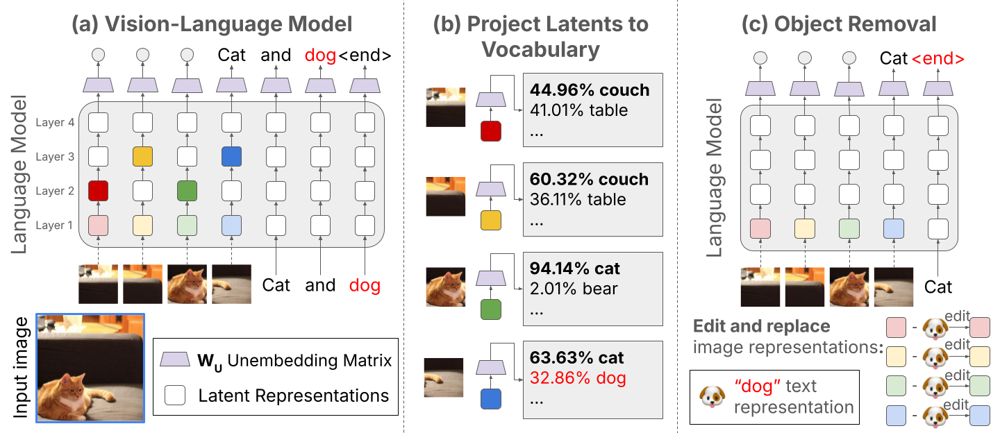

# Interpreting and Editing Vision-Language Representations to Mitigate Hallucinations
Official PyTorch Implementation

[Nick Jiang](https://nickjiang.me), [Anish Kachinthaya](https://anishk.me), [Suzanne Petryk](https://suziepetryk.com/), [Yossi Gandelsman](https://yossigandelsman.github.io/)
### [Paper](https://arxiv.org/pdf/2410.02762) | [Project Page](https://anishk23733.github.io/vl-interp/)



## Setup

### Files
```
git clone git@github.com:nickjiang2378/vl-interp.git
cd vl-interp
```

### Environment

```
# Create a new conda environment
conda create -n vl python=3.9
conda activate vl

# Set up LLaVA repo
mkdir src/caption/llava
cd src/caption/llava
git clone https://github.com/haotian-liu/LLaVA.git
cd LLaVA
pip3 install -e .

# cd back into repo root
cd ../../../../
pip3 install -e .

# Install some remaining packages
pip3 install lightning openai-clip transformers==4.37.2 omegaconf python-dotenv
```

### Model Weights

The configs for InstructBLIP models are under `src/caption/lavis/configs/`.

In order to get InstructBLIP (7B) working, you should download the [pretrained model weights](https://storage.googleapis.com/sfr-vision-language-research/LAVIS/models/InstructBLIP/instruct_blip_vicuna7b_trimmed.pth) and [vicuna7b weights](https://huggingface.co/lmsys/vicuna-7b-v1.1).

In `src/caption/lavis/configs/blip2_instruct_vicuna7b.yaml`, set the `pretrained` location to the pretrained weight path and `llm_model` to the vicuna7b weight path.

## Demos

Our paper presents two primary methods to interpret and edit VL representations. The first method creates a model confidence score for model-generated objects by projecting image representations to the language vocabulary and taking a max softmax score of the output probabilities. Our second method targets and removes objects from image captions by subtracting the text embeddings of targeted objects from these image representations.

To explore internal model confidences and their applications for hallucination detection and zero-shot segmentation, check out `demos/internal_confidence.ipynb`.

To erase objects by editing internal representations, run `demos/object_erasure.ipynb`.

## Evals

Generated captions for the hallucination reduction task (Section 5.2) are in `log_results/`. To evaluate CHAIR scores, run
```
python3 metric/chair.py --cap_file <log_file> --cache metric/chair.pkl
```

You may need to run the following in your conda environment before CHAIR works:
```
>>> import nltk
>>> nltk.download('punkt_tab')
```

## BibTeX
```
@misc{jiang2024interpretingeditingvisionlanguagerepresentations,
      title={Interpreting and Editing Vision-Language Representations to Mitigate Hallucinations},
      author={Nick Jiang and Anish Kachinthaya and Suzie Petryk and Yossi Gandelsman},
      year={2024},
      eprint={2410.02762},
      archivePrefix={arXiv},
      primaryClass={cs.CV},
      url={https://arxiv.org/abs/2410.02762},
}
```

## Acknowledgments
We thank Kayo Yin for her comments and feedback on our paper. YG is supported by the Google
Fellowship. As part of their affiliation with UC Berkeley, authors were supported in part by the the
Berkeley Artificial Intelligence Research (BAIR) commons program.
